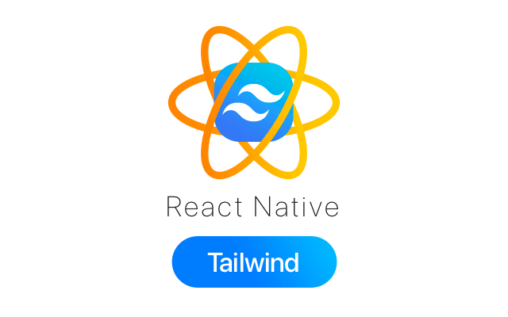
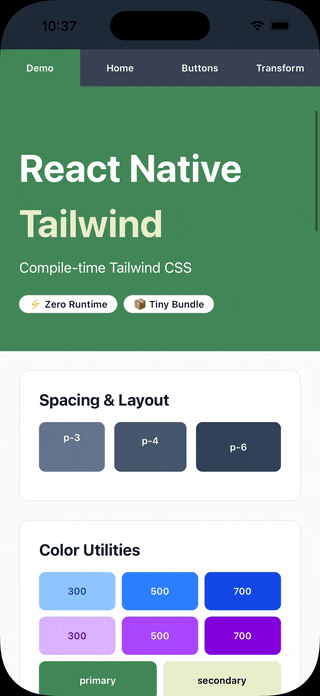

<!-- # React Native Tailwind -->

<!-- markdownlint-disable MD033 -->
<p align="center">
  <a href="https://mgcrea.github.io/react-native-swiftui">
    
  </a>
</p>
<p align="center">
  <a href="https://www.npmjs.com/package/@mgcrea/react-native-tailwind">
    
  </a>
  <a href="https://www.npmjs.com/package/@mgcrea/react-native-tailwind">
    
  </a>
  <a href="https://www.npmjs.com/package/@mgcrea/react-native-tailwind">
    
  </a>
  <a href="https://www.npmjs.com/package/@mgcrea/react-native-tailwind">
    
  </a>
  <br />
  <a href="https://github.com/mgcrea/react-native-tailwind/actions/workflows/main.yaml">
    
  </a>
  <a href="https://depfu.com/github/mgcrea/react-native-tailwind">
    
  </a>
</p>

## Overview

Compile-time Tailwind CSS for React Native with zero runtime overhead. Transform `className` props to optimized `StyleSheet.create` calls at build time using a Babel plugin.

## Features

- ⚡ **Zero runtime overhead** — All transformations happen at compile time
- 🔧 **No dependencies** — Direct-to-React-Native style generation without tailwindcss package
- 🎯 **Babel-only setup** — No Metro configuration required
- 📝 **TypeScript-first** — Full type safety and autocomplete support
- 🚀 **Optimized performance** — Compiles down to `StyleSheet.create` for optimal performance
- 📦 **Small bundle size** — Only includes actual styles used in your app
- 🎨 **Custom colors** — Extend the default palette via `tailwind.config.*`
- 📐 **Arbitrary values** — Use custom sizes and borders: `w-[123px]`, `rounded-[20px]`
- 🔀 **Dynamic className** — Conditional styles with hybrid compile-time optimization
- 🎯 **State modifiers** — `active:`, `hover:`, `focus:`, and `disabled:` modifiers for interactive components
- 📜 **Special style props** — Support for `contentContainerClassName`, `columnWrapperClassName`, and more
- 🎛️ **Custom attributes** — Configure which props to transform with exact matching or glob patterns

## Demo



## Installation

```bash
npm install @mgcrea/react-native-tailwind
# or
yarn add @mgcrea/react-native-tailwind
# or
pnpm add @mgcrea/react-native-tailwind
```

## Setup

### 1. Add Babel Plugin

Update your `babel.config.js`:

```javascript
module.exports = {
  presets: ["module:@react-native/babel-preset"],
  plugins: [
    "@mgcrea/react-native-tailwind/babel", // Add this line
  ],
};
```

**Advanced:** You can customize which attributes are transformed and the generated styles identifier:

```javascript
module.exports = {
  presets: ["module:@react-native/babel-preset"],
  plugins: [
    [
      "@mgcrea/react-native-tailwind/babel",
      {
        // Specify which attributes to transform
        // Default: ['className', 'contentContainerClassName', 'columnWrapperClassName', 'ListHeaderComponentClassName', 'ListFooterComponentClassName']
        attributes: ["className", "buttonClassName", "containerClassName"],

        // Custom identifier for the generated StyleSheet constant
        // Default: '_twStyles'
        stylesIdentifier: "styles",
      },
    ],
  ],
};
```

### 2. Enable TypeScript Support (TypeScript)

Create a type declaration file in your project to enable `className` prop autocomplete:

**Create `src/types/react-native-tailwind.d.ts`:**

```typescript
import "@mgcrea/react-native-tailwind/react-native";
```

This file will be automatically picked up by TypeScript and enables autocomplete for the `className` prop on all React Native components.

> **Why is this needed?** TypeScript module augmentation requires the declaration file to be part of your project's compilation context. This one-time setup ensures the `className` prop is recognized throughout your codebase.

### 3. Start Using className

```tsx
import { View, Text } from "react-native";

export function MyComponent() {
  return (
    <View className="flex-1 bg-gray-100 p-4">
      <Text className="text-xl font-bold text-blue-500">Hello, Tailwind!</Text>
    </View>
  );
}
```

## How It Works

The Babel plugin transforms your code at compile time:

**Input** (what you write):

```tsx
<View className="m-4 p-2 bg-blue-500 rounded-lg" />
<ScrollView contentContainerClassName="items-center gap-4" />
<FlatList columnWrapperClassName="gap-4" ListHeaderComponentClassName="p-4 bg-gray-100" />
```

**Output** (what Babel generates):

```tsx
import { StyleSheet } from "react-native";

<View style={_twStyles._bg_blue_500_m_4_p_2_rounded_lg} />;
<ScrollView contentContainerStyle={_twStyles._gap_4_items_center} />;
<FlatList columnWrapperStyle={_twStyles._gap_4} ListHeaderComponentStyle={_twStyles._bg_gray_100_p_4} />;

const _twStyles = StyleSheet.create({
  _bg_blue_500_m_4_p_2_rounded_lg: {
    margin: 16,
    padding: 8,
    backgroundColor: "#3B82F6",
    borderRadius: 8,
  },
  _gap_4_items_center: {
    gap: 16,
    alignItems: "center",
  },
  _gap_4: {
    gap: 16,
  },
  _bg_gray_100_p_4: {
    backgroundColor: "#F3F4F6",
    padding: 16,
  },
});
```

## Usage Examples

### Basic Example

```tsx
import { View, Text } from "react-native";

export function MyComponent() {
  return (
    <View className="flex-1 bg-gray-100 p-4">
      <Text className="text-xl font-bold text-blue-500">Hello, Tailwind!</Text>
    </View>
  );
}
```

### Card Component

```tsx
import { View, Text } from "react-native";
import { Pressable } from "@mgcrea/react-native-tailwind";

export function Card({ title, description, onPress }) {
  return (
    <View className="bg-white rounded-lg p-6 mb-4 border border-gray-200">
      <Text className="text-xl font-semibold text-gray-900 mb-2">{title}</Text>
      <Text className="text-base text-gray-600 mb-4">{description}</Text>
      <Pressable
        className="bg-blue-500 active:bg-blue-700 px-4 py-2 rounded-lg items-center"
        onPress={onPress}
      >
        <Text className="text-white font-semibold">Learn More</Text>
      </Pressable>
    </View>
  );
}
```

### Dynamic className (Hybrid Optimization)

You can use dynamic expressions in `className` for conditional styling. The Babel plugin will parse all static strings at compile-time and preserve the conditional logic:

**Conditional Expression:**

```tsx
import { useState } from "react";
import { View, Text, Pressable } from "react-native";

export function ToggleButton() {
  const [isActive, setIsActive] = useState(false);

  return (
    <Pressable
      onPress={() => setIsActive(!isActive)}
      className={isActive ? "bg-green-500 p-4" : "bg-red-500 p-4"}
    >
      <Text className="text-white">{isActive ? "Active" : "Inactive"}</Text>
    </Pressable>
  );
}
```

**Transforms to:**

```tsx
<Pressable
  onPress={() => setIsActive(!isActive)}
  style={isActive ? _twStyles._bg_green_500_p_4 : _twStyles._bg_red_500_p_4}
>
  <Text style={_twStyles._text_white}>{isActive ? "Active" : "Inactive"}</Text>
</Pressable>
```

**Template Literal (Static + Dynamic):**

```tsx
<Pressable className={`border-2 rounded-lg ${isActive ? "bg-blue-500" : "bg-gray-300"} p-4`}>
  <Text className="text-white">Click Me</Text>
</Pressable>
```

**Transforms to:**

```tsx
<Pressable
  style={[
    _twStyles._border_2,
    _twStyles._rounded_lg,
    isActive ? _twStyles._bg_blue_500 : _twStyles._bg_gray_300,
    _twStyles._p_4,
  ]}
>
  <Text style={_twStyles._text_white}>Click Me</Text>
</Pressable>
```

**Logical Expression:**

```tsx
<View className={`p-4 bg-gray-100 ${isActive && "border-4 border-purple-500"}`}>
  <Text>Content</Text>
</View>
```

**Transforms to:**

```tsx
<View style={[_twStyles._p_4, _twStyles._bg_gray_100, isActive && _twStyles._border_4_border_purple_500]}>
  <Text>Content</Text>
</View>
```

**Multiple Conditionals:**

```tsx
<View className={`${size === "lg" ? "p-8" : "p-4"} ${isActive ? "bg-blue-500" : "bg-gray-400"}`}>
  <Text>Dynamic Size & Color</Text>
</View>
```

**Key Benefits:**

- ✅ All string literals are parsed at compile-time
- ✅ Only conditional logic remains at runtime (no parser overhead)
- ✅ Full type-safety and validation for all class names
- ✅ Optimal performance with pre-compiled styles

**What Won't Work:**

```tsx
// ❌ Runtime variables in class names
const spacing = 4;
<View className={`p-${spacing}`} />  // Can't parse "p-${spacing}" at compile time

// ✅ Use inline style for truly dynamic values:
<View className="border-2" style={{ padding: spacing * 4 }} />
```

### Combining with Inline Styles

You can use inline `style` prop alongside `className`:

```tsx
<View className="flex-1 p-4 bg-blue-500" style={{ paddingTop: safeAreaInsets.top }}>
  <Text>Content</Text>
</View>
```

The Babel plugin will merge them:

```tsx
<View style={[_twStyles._className_styles, { paddingTop: safeAreaInsets.top }]}>
  <Text>Content</Text>
</View>
```

### State Modifiers

Apply styles based on component state with zero runtime overhead. The Babel plugin automatically generates optimized style functions.

#### Active Modifier (Pressable)

Use the `active:` modifier to apply styles when a `Pressable` component is pressed. **Requires using the enhanced `Pressable` component from this package.**

**Basic Example:**

```tsx
import { Text } from "react-native";
import { Pressable } from "@mgcrea/react-native-tailwind";

export function MyButton() {
  return (
    <Pressable className="bg-blue-500 active:bg-blue-700 p-4 rounded-lg">
      <Text className="text-white font-semibold">Press Me</Text>
    </Pressable>
  );
}
```

**Transforms to:**

```tsx
<Pressable
  style={({ pressed }) => [_twStyles._bg_blue_500_p_4_rounded_lg, pressed && _twStyles._active_bg_blue_700]}
>
  <Text style={_twStyles._font_semibold_text_white}>Press Me</Text>
</Pressable>;

// Generated styles:
const _twStyles = StyleSheet.create({
  _bg_blue_500_p_4_rounded_lg: { backgroundColor: "#3B82F6", padding: 16, borderRadius: 8 },
  _active_bg_blue_700: { backgroundColor: "#1D4ED8" },
  _font_semibold_text_white: { fontWeight: "600", color: "#FFFFFF" },
});
```

**Multiple Active Modifiers:**

```tsx
<Pressable className="bg-green-500 active:bg-green-700 p-4 active:p-6 rounded-lg">
  <Text className="text-white">Press for darker & larger padding</Text>
</Pressable>
```

**Complex Styling:**

```tsx
<Pressable className="bg-purple-500 active:bg-purple-800 border-2 border-purple-700 active:border-purple-900 p-4 rounded-lg">
  <Text className="text-white">Background + Border Changes</Text>
</Pressable>
```

**Key Features:**

- ✅ **Zero runtime overhead** — All parsing happens at compile-time
- ✅ **Native Pressable API** — Uses Pressable's `style={({ pressed }) => ...}` pattern
- ✅ **Type-safe** — Full TypeScript autocomplete for `active:` classes
- ✅ **Optimized** — Styles deduplicated via `StyleSheet.create`
- ✅ **Works with custom colors** — `active:bg-primary`, `active:bg-secondary`, etc.

#### Focus Modifier (TextInput)

Use the `focus:` modifier to apply styles when a `TextInput` component is focused. **Requires using the enhanced `TextInput` component from this package.**

**Basic Example:**

```tsx
import { TextInput } from "@mgcrea/react-native-tailwind";

export function MyInput() {
  return (
    <TextInput
      className="border-2 border-gray-300 focus:border-blue-500 p-3 rounded-lg bg-white"
      placeholder="Email address"
    />
  );
}
```

**How it works:**

The package exports an enhanced `TextInput` component that:

1. Manages focus state internally using `onFocus`/`onBlur` callbacks
2. Passes focus state to the style function: `style={({ focused }) => ...}`
3. Works seamlessly with the `focus:` modifier in className

**Multiple Focus Modifiers:**

```tsx
<TextInput className="border-2 border-gray-300 focus:border-green-500 bg-gray-50 focus:bg-white p-3 rounded-lg" />
```

**Supported Modifiers by Component:**

| Component              | Supported Modifiers                        | Notes                                      |
| ---------------------- | ------------------------------------------ | ------------------------------------------ |
| `Pressable` (enhanced) | `active:`, `hover:`, `focus:`, `disabled:` | Use `@mgcrea/react-native-tailwind` export |
| `TextInput` (enhanced) | `focus:`, `disabled:`                      | Use `@mgcrea/react-native-tailwind` export |

#### Disabled Modifier (Pressable & TextInput)

Use the `disabled:` modifier to apply styles when a component is disabled. **Requires using the enhanced components from this package.**

**Pressable Example:**

```tsx
import { Pressable, Text } from "@mgcrea/react-native-tailwind";

export function SubmitButton({ isLoading }) {
  return (
    <Pressable
      disabled={isLoading}
      className="bg-blue-500 active:bg-blue-700 disabled:bg-gray-400 p-4 rounded-lg"
    >
      <Text className="text-white font-semibold">{isLoading ? "Loading..." : "Submit"}</Text>
    </Pressable>
  );
}
```

**TextInput Example:**

```tsx
import { TextInput } from "@mgcrea/react-native-tailwind";

export function MyInput({ isEditing }) {
  return (
    <TextInput
      disabled={!isEditing}
      className="border-2 border-gray-300 focus:border-blue-500 disabled:bg-gray-100 disabled:border-gray-200 p-3 rounded-lg"
      placeholder="Enter text"
    />
  );
}
```

**How it works:**

The enhanced components inject the `disabled` prop value into the style function context:

- **Pressable**: Extends the existing `{ pressed, hovered, focused }` state with `disabled`
- **TextInput**: Provides `{ focused, disabled }` state to style functions

**TextInput `disabled` Prop:**

The enhanced `TextInput` also provides a convenient `disabled` prop that overrides React Native's `editable` prop:

```tsx
// These are equivalent:
<TextInput disabled={true} />
<TextInput editable={false} />

// If both are provided, disabled takes precedence:
<TextInput disabled={true} editable={true} /> // Component is disabled
```

**Important Notes:**

- ⚠️ **Enhanced components required** — State modifiers require using the enhanced components from this package
- ℹ️ **Component-specific** — Each modifier only works on compatible components
- ℹ️ **No nested modifiers** — Combinations like `active:focus:bg-blue-500` are not currently supported
- ✅ **Zero styling overhead** — All className parsing happens at compile-time
- ✅ **Minimal runtime cost** — Only adds state management (focus tracking, disabled injection)
- ✅ **Type-safe** — Full TypeScript autocomplete for all modifiers
- ✅ **Works with custom colors** — `focus:border-primary`, `active:bg-secondary`, `disabled:bg-gray-200`, etc.

### ScrollView Content Container

Use `contentContainerClassName` to style the ScrollView's content container:

```tsx
import { ScrollView, View, Text } from "react-native";

export function MyScrollView() {
  return (
    <ScrollView className="flex-1 bg-gray-100" contentContainerClassName="items-center p-4 gap-4">
      <View className="bg-white rounded-lg p-4">
        <Text className="text-lg">Item 1</Text>
      </View>
      <View className="bg-white rounded-lg p-4">
        <Text className="text-lg">Item 2</Text>
      </View>
    </ScrollView>
  );
}
```

### FlatList with Column Wrapper

Use `columnWrapperClassName` for multi-column FlatLists:

```tsx
import { FlatList, View, Text } from "react-native";

export function GridList({ items }) {
  return (
    <FlatList
      className="flex-1 bg-gray-100"
      contentContainerClassName="p-4"
      columnWrapperClassName="gap-4 mb-4"
      numColumns={2}
      data={items}
      renderItem={({ item }) => (
        <View className="flex-1 bg-white rounded-lg p-4">
          <Text className="text-lg">{item.name}</Text>
        </View>
      )}
    />
  );
}
```

### FlatList with Header and Footer

Use `ListHeaderComponentClassName` and `ListFooterComponentClassName`:

```tsx
import { FlatList, View, Text } from "react-native";

export function ListWithHeaderFooter({ items }) {
  return (
    <FlatList
      className="flex-1"
      contentContainerClassName="p-4"
      ListHeaderComponentClassName="p-4 bg-blue-500 mb-4 rounded-lg"
      ListFooterComponentClassName="p-4 bg-gray-200 mt-4 rounded-lg"
      data={items}
      ListHeaderComponent={<Text className="text-white font-bold">Header</Text>}
      ListFooterComponent={<Text className="text-gray-600">End of list</Text>}
      renderItem={({ item }) => (
        <View className="bg-white rounded-lg p-4 mb-2">
          <Text>{item.name}</Text>
        </View>
      )}
    />
  );
}
```

### Building Reusable Components

When building reusable components, use static `className` strings internally. To support `className` props from parent components, you **must** accept the corresponding `style` props (the Babel plugin transforms `className` to `style` before your component receives it):

```tsx
import { Pressable, Text, View, StyleProp, ViewStyle } from "react-native";

type ButtonProps = {
  title: string;
  onPress?: () => void;
  // REQUIRED: Must accept style props for className to work
  style?: StyleProp<ViewStyle>;
  containerStyle?: StyleProp<ViewStyle>;
  // Optional: Include in type for TypeScript compatibility
  className?: string; // compile-time only
  containerClassName?: string; // compile-time only
};

export function Button({ title, onPress, style, containerStyle }: ButtonProps) {
  // Use static className strings - these get optimized at compile-time
  return (
    <View className="p-2 bg-gray-100 rounded-lg" style={containerStyle}>
      <Pressable className="bg-blue-500 px-6 py-4 rounded-lg items-center" onPress={onPress} style={style}>
        <Text className="text-white text-center font-semibold text-base">{title}</Text>
      </Pressable>
    </View>
  );
}
```

**Key Points:**

- ✅ Use **static className strings** internally for default styling
- ✅ **Must accept `style` props** - the Babel plugin transforms `className` → `style` before your component receives it
- ✅ Include `className` props in the type (for TypeScript compatibility)
- ✅ **Don't destructure** className props - they're already transformed to `style` and will be `undefined` at runtime
- ✅ Babel plugin optimizes all static strings to `StyleSheet.create` calls

**Usage:**

```tsx
// Default styling (uses internal static classNames)
<Button title="Click Me" onPress={handlePress} />

// Override with runtime styles
<Button
  title="Custom"
  style={{ backgroundColor: '#10B981' }}
  containerStyle={{ padding: 16 }}
  onPress={handlePress}
/>

// className props are accepted but transformed by Babel upstream
<Button className="bg-red-500 p-8" title="Red Button" />
// At compile-time, this becomes:
// <Button style={_twStyles._bg_red_500_p_8} title="Red Button" />
// At runtime, className is undefined (already transformed to style)
```

This pattern allows you to build component libraries with optimized default styling while still supporting full customization.

## API Reference

### Spacing

**Margin & Padding:**

- `m-{size}`, `p-{size}` — All sides
- `mx-{size}`, `my-{size}`, `px-{size}`, `py-{size}` — Horizontal/vertical
- `mt-{size}`, `mr-{size}`, `mb-{size}`, `ml-{size}` — Directional margin
- `pt-{size}`, `pr-{size}`, `pb-{size}`, `pl-{size}` — Directional padding
- `gap-{size}` — Gap between flex items

**Available sizes:** `0`, `0.5`, `1`, `1.5`, `2`, `2.5`, `3`, `3.5`, `4`, `5`, `6`, `7`, `8`, `9`, `10`, `11`, `12`, `14`, `16`, `20`, `24`, `28`, `32`, `36`, `40`, `44`, `48`, `52`, `56`, `60`, `64`, `72`, `80`, `96`

**Arbitrary values:** `m-[16px]`, `p-[20]`, `mx-[24px]`, `gap-[12px]` — Custom spacing values (px only)

### Layout

**Flexbox:**

- `flex`, `flex-1`, `flex-auto`, `flex-none` — Flex sizing
- `flex-row`, `flex-row-reverse`, `flex-col`, `flex-col-reverse` — Direction
- `flex-wrap`, `flex-wrap-reverse`, `flex-nowrap` — Wrapping
- `items-start`, `items-end`, `items-center`, `items-baseline`, `items-stretch` — Align items
- `justify-start`, `justify-end`, `justify-center`, `justify-between`, `justify-around`, `justify-evenly` — Justify content
- `self-auto`, `self-start`, `self-end`, `self-center`, `self-stretch`, `self-baseline` — Align self
- `grow`, `grow-0`, `shrink`, `shrink-0` — Flex grow/shrink

**Other:**

- `absolute`, `relative` — Position
- `overflow-hidden`, `overflow-visible`, `overflow-scroll` — Overflow
- `flex`, `hidden` — Display

### Colors

- `bg-{color}-{shade}` — Background color
- `text-{color}-{shade}` — Text color
- `border-{color}-{shade}` — Border color

**Available colors:** `gray`, `red`, `blue`, `green`, `yellow`, `purple`, `pink`, `orange`, `indigo`, `white`, `black`, `transparent`

**Available shades:** `50`, `100`, `200`, `300`, `400`, `500`, `600`, `700`, `800`, `900`

> **Note:** You can extend the color palette with custom colors via `tailwind.config.*` — see [Custom Colors](#custom-colors)

**Opacity Modifiers:**

Apply transparency to any color using the `/` operator with a percentage value (0-100):

```tsx
<View className="bg-black/50 p-4">
  {" "}
  {/* 50% opacity black background */}
  <Text className="text-gray-900/80">
    {" "}
    {/* 80% opacity gray text */}
    Semi-transparent content
  </Text>
  <View className="border-2 border-red-500/30" /> {/* 30% opacity red border */}
</View>
```

- Works with all color types: `bg-*`, `text-*`, `border-*`
- Supports preset colors: `bg-blue-500/75`, `text-red-600/50`
- Supports arbitrary colors: `bg-[#ff0000]/40`, `text-[#3B82F6]/90`
- Supports custom colors: `bg-primary/60`, `text-brand/80`
- Uses React Native's 8-digit hex format: `#RRGGBBAA`

**Examples:**

```tsx
// Background opacity
<View className="bg-white/90" />          // #FFFFFFE6
<View className="bg-blue-500/50" />       // #3B82F680

// Text opacity
<Text className="text-black/70" />        // #000000B3
<Text className="text-gray-900/60" />     // #11182799

// Border opacity
<View className="border-2 border-purple-500/40" /> // #A855F766

// Arbitrary colors with opacity
<View className="bg-[#ff6b6b]/25" />      // #FF6B6B40

// Edge cases
<View className="bg-black/0" />           // Fully transparent
<View className="bg-blue-500/100" />      // Fully opaque
<View className="bg-transparent/50" />    // Remains transparent
```

### Typography

**Font Size:**

`text-xs`, `text-sm`, `text-base`, `text-lg`, `text-xl`, `text-2xl`, `text-3xl`, `text-4xl`, `text-5xl`, `text-6xl`, `text-7xl`, `text-8xl`, `text-9xl`

**Font Weight:**

`font-thin`, `font-extralight`, `font-light`, `font-normal`, `font-medium`, `font-semibold`, `font-bold`, `font-extrabold`, `font-black`

**Other:**

- `italic`, `not-italic` — Font style
- `text-left`, `text-center`, `text-right`, `text-justify` — Text alignment
- `underline`, `line-through`, `no-underline` — Text decoration
- `uppercase`, `lowercase`, `capitalize`, `normal-case` — Text transform
- `leading-none`, `leading-tight`, `leading-snug`, `leading-normal`, `leading-relaxed`, `leading-loose` — Line height

### Borders

**Width:**

- `border`, `border-0`, `border-2`, `border-4`, `border-8` — All sides
- `border-t`, `border-r`, `border-b`, `border-l` (with variants `-0`, `-2`, `-4`, `-8`) — Directional
- `border-[8px]`, `border-t-[12px]` — Arbitrary values

**Radius:**

- `rounded-none`, `rounded-sm`, `rounded`, `rounded-md`, `rounded-lg`, `rounded-xl`, `rounded-2xl`, `rounded-3xl`, `rounded-full` — All corners
- `rounded-t`, `rounded-r`, `rounded-b`, `rounded-l` (with size variants) — Directional
- `rounded-tl`, `rounded-tr`, `rounded-bl`, `rounded-br` (with size variants) — Individual corners
- `rounded-[12px]`, `rounded-t-[8px]`, `rounded-tl-[16px]` — Arbitrary values

**Style:**

`border-solid`, `border-dotted`, `border-dashed`

### Shadows & Elevation

Apply platform-specific shadows and elevation to create depth and visual hierarchy. Automatically uses iOS shadow properties or Android elevation based on the platform:

**Available shadow sizes:**

- `shadow-sm` — Subtle shadow
- `shadow` — Default shadow
- `shadow-md` — Medium shadow
- `shadow-lg` — Large shadow
- `shadow-xl` — Extra large shadow
- `shadow-2xl` — Extra extra large shadow
- `shadow-none` — Remove shadow

**Platform Differences:**

| Platform    | Properties Used                                                | Example Output                             |
| ----------- | -------------------------------------------------------------- | ------------------------------------------ |
| **iOS**     | `shadowColor`, `shadowOffset`, `shadowOpacity`, `shadowRadius` | Native iOS shadow rendering                |
| **Android** | `elevation`                                                    | Native Android elevation (Material Design) |

**Examples:**

```tsx
// Card with shadow
<View className="bg-white rounded-lg shadow-lg p-6 m-4">
  <Text className="text-xl font-bold">Card Title</Text>
  <Text className="text-gray-600">Card with large shadow</Text>
</View>

// Button with subtle shadow
<Pressable className="bg-blue-500 shadow-sm rounded-lg px-6 py-3">
  <Text className="text-white">Press Me</Text>
</Pressable>

// Different shadow sizes
<View className="shadow-sm p-4">Subtle</View>
<View className="shadow p-4">Default</View>
<View className="shadow-md p-4">Medium</View>
<View className="shadow-lg p-4">Large</View>
<View className="shadow-xl p-4">Extra Large</View>
<View className="shadow-2xl p-4">2X Large</View>

// Remove shadow
<View className="shadow-lg md:shadow-none p-4">
  Conditional shadow removal
</View>
```

**iOS Shadow Values:**

| Class        | shadowOpacity | shadowRadius | shadowOffset             |
| ------------ | ------------- | ------------ | ------------------------ |
| `shadow-sm`  | 0.05          | 1            | { width: 0, height: 1 }  |
| `shadow`     | 0.1           | 2            | { width: 0, height: 1 }  |
| `shadow-md`  | 0.15          | 4            | { width: 0, height: 3 }  |
| `shadow-lg`  | 0.2           | 8            | { width: 0, height: 6 }  |
| `shadow-xl`  | 0.25          | 12           | { width: 0, height: 10 } |
| `shadow-2xl` | 0.3           | 24           | { width: 0, height: 20 } |

**Android Elevation Values:**

| Class        | elevation |
| ------------ | --------- |
| `shadow-sm`  | 1         |
| `shadow`     | 2         |
| `shadow-md`  | 4         |
| `shadow-lg`  | 8         |
| `shadow-xl`  | 12        |
| `shadow-2xl` | 16        |

> **Note:** All shadow parsing happens at compile-time with zero runtime overhead. The platform detection uses React Native's `Platform.select()` API.

### Aspect Ratio

Control the aspect ratio of views using preset or arbitrary values. Requires React Native 0.71+:

**Preset values:**

- `aspect-auto` — Remove aspect ratio constraint
- `aspect-square` — 1:1 aspect ratio
- `aspect-video` — 16:9 aspect ratio

**Arbitrary values:**

Use `aspect-[width/height]` for custom ratios:

```tsx
<View className="aspect-[4/3]" />    // 4:3 ratio (1.333...)
<View className="aspect-[16/9]" />   // 16:9 ratio (1.778...)
<View className="aspect-[21/9]" />   // 21:9 ultrawide
<View className="aspect-[9/16]" />   // 9:16 portrait
<View className="aspect-[3/2]" />    // 3:2 ratio (1.5)
```

**Examples:**

```tsx
// Square image container
<View className="w-full aspect-square bg-gray-200">
  <Image source={avatar} className="w-full h-full" />
</View>

// Video player container (16:9)
<View className="w-full aspect-video bg-black">
  <VideoPlayer />
</View>

// Instagram-style square grid
<View className="flex-row flex-wrap gap-2">
  {photos.map((photo) => (
    <View key={photo.id} className="w-[32%] aspect-square">
      <Image source={photo.uri} className="w-full h-full rounded" />
    </View>
  ))}
</View>

// Custom aspect ratio for wide images
<View className="w-full aspect-[21/9] rounded-lg overflow-hidden">
  <Image source={banner} className="w-full h-full" resizeMode="cover" />
</View>

// Portrait orientation
<View className="h-full aspect-[9/16]">
  <Story />
</View>

// Remove aspect ratio constraint
<View className="aspect-square md:aspect-auto">
  Responsive aspect ratio
</View>
```

**Common Aspect Ratios:**

| Ratio | Class           | Decimal | Use Case                     |
| ----- | --------------- | ------- | ---------------------------- |
| 1:1   | `aspect-square` | 1.0     | Profile pictures, thumbnails |
| 16:9  | `aspect-video`  | 1.778   | Videos, landscape photos     |
| 4:3   | `aspect-[4/3]`  | 1.333   | Standard photos              |
| 3:2   | `aspect-[3/2]`  | 1.5     | Classic photography          |
| 21:9  | `aspect-[21/9]` | 2.333   | Ultrawide/cinematic          |
| 9:16  | `aspect-[9/16]` | 0.5625  | Stories, vertical video      |

> **Note:** The aspect ratio is calculated as `width / height`. When combined with `w-full`, the height will be automatically calculated to maintain the ratio.

### Transforms

Apply 2D and 3D transformations to views with React Native's transform API. All transforms compile to optimized transform arrays at build time:

**Scale:**

- `scale-{value}` — Scale uniformly (both X and Y)
- `scale-x-{value}`, `scale-y-{value}` — Scale on specific axis
- **Values:** `0`, `50`, `75`, `90`, `95`, `100`, `105`, `110`, `125`, `150`, `200`
- **Arbitrary:** `scale-[1.23]`, `scale-x-[0.5]`, `scale-y-[2.5]`

**Rotate:**

- `rotate-{degrees}`, `-rotate-{degrees}` — Rotate in 2D
- `rotate-x-{degrees}`, `rotate-y-{degrees}`, `rotate-z-{degrees}` — Rotate on specific axis
- **Values:** `0`, `1`, `2`, `3`, `6`, `12`, `45`, `90`, `180`
- **Arbitrary:** `rotate-[37deg]`, `-rotate-[15deg]`, `rotate-x-[30deg]`

**Translate:**

- `translate-x-{spacing}`, `translate-y-{spacing}` — Move on specific axis
- `-translate-x-{spacing}`, `-translate-y-{spacing}` — Negative translation
- **Values:** Uses spacing scale (same as `m-*`, `p-*`)
- **Arbitrary:** `translate-x-[50px]`, `translate-y-[100px]`, `translate-x-[50%]`

**Skew:**

- `skew-x-{degrees}`, `skew-y-{degrees}` — Skew on specific axis
- `-skew-x-{degrees}`, `-skew-y-{degrees}` — Negative skew
- **Values:** `0`, `1`, `2`, `3`, `6`, `12`
- **Arbitrary:** `skew-x-[15deg]`, `-skew-y-[8deg]`

**Perspective:**

- `perspective-{value}` — Apply perspective transformation
- **Values:** `0`, `100`, `200`, `300`, `400`, `500`, `600`, `700`, `800`, `900`, `1000`
- **Arbitrary:** `perspective-[1500]`, `perspective-[2000]`

**Examples:**

```tsx
// Scale
<View className="scale-110 p-4">
  {/* 110% scale (1.1x larger) */}
  <Text>Scaled content</Text>
</View>

// Rotate
<View className="rotate-45 w-16 h-16 bg-blue-500" />

// Translate
<View className="translate-x-4 translate-y-2 bg-red-500 p-4">
  {/* Moved 16px right, 8px down */}
</View>

// Arbitrary values
<View className="scale-[1.23] w-16 h-16 bg-green-500" />
<View className="rotate-[37deg] w-16 h-16 bg-purple-500" />
<View className="translate-x-[50px] bg-orange-500 p-4" />

// Negative values
<View className="-rotate-45 w-16 h-16 bg-pink-500" />
<View className="-translate-x-4 -translate-y-2 bg-indigo-500 p-4" />

// 3D rotation
<View className="rotate-x-45 w-16 h-16 bg-yellow-500" />
<View className="rotate-y-30 w-16 h-16 bg-teal-500" />

// Skew
<View className="skew-x-6 w-16 h-16 bg-cyan-500" />

// Perspective
<View className="perspective-500">
  <View className="rotate-x-45 w-16 h-16 bg-blue-500" />
</View>
```

**Multiple Transforms Limitation:**

Due to the current architecture, multiple transform classes on the same element will overwrite each other. For example:

```tsx
// ❌ Only rotate-45 will apply (overwrites scale-110)
<View className="scale-110 rotate-45 w-16 h-16 bg-blue-500" />

// ✅ Workaround: Use nested Views for multiple transforms
<View className="scale-110">
  <View className="rotate-45">
    <View className="w-16 h-16 bg-blue-500" />
  </View>
</View>
```

This limitation exists because the current parser architecture uses `Object.assign()` which overwrites the `transform` property when multiple transform classes are present. This will be addressed in a future update by modifying the Babel plugin to detect multiple transform classes and generate style arrays.

**What's Not Supported:**

- `transform-origin` — Not available in React Native (transforms always use center as origin)
- Multiple transforms on one element — Use nested Views (see workaround above)

> **Note:** All transform parsing happens at compile-time with zero runtime overhead. Each transform compiles to a React Native transform array: `transform: [{ scale: 1.1 }]`, `transform: [{ rotate: '45deg' }]`, etc.

### Sizing

- `w-{size}`, `h-{size}` — Width/height
- `min-w-{size}`, `min-h-{size}` — Min width/height
- `max-w-{size}`, `max-h-{size}` — Max width/height

**Available sizes:**

- **Numeric:** `0`-`96` (same as spacing scale)
- **Fractional:** `1/2`, `1/3`, `2/3`, `1/4`, `3/4`, `1/5`, `2/5`, `3/5`, `4/5`, `1/6`, `2/6`, `3/6`, `4/6`, `5/6`
- **Special:** `full` (100%), `auto`
- **Arbitrary:** `w-[123px]`, `h-[50%]`, `min-w-[200px]`, `max-h-[80%]`

> **Note:** Arbitrary sizing supports pixel values (`[123px]` or `[123]`) and percentages (`[50%]`). Other units (`rem`, `em`, `vh`, `vw`) are not supported in React Native.

## Advanced

### Custom Attributes

By default, the Babel plugin transforms these className-like attributes to their corresponding style props:

- `className` → `style`
- `contentContainerClassName` → `contentContainerStyle` (ScrollView, FlatList)
- `columnWrapperClassName` → `columnWrapperStyle` (FlatList)
- `ListHeaderComponentClassName` → `ListHeaderComponentStyle` (FlatList)
- `ListFooterComponentClassName` → `ListFooterComponentStyle` (FlatList)

You can customize which attributes are transformed using the `attributes` plugin option:

**Exact Matches:**

```javascript
// babel.config.js
module.exports = {
  plugins: [
    [
      "@mgcrea/react-native-tailwind/babel",
      {
        attributes: ["className", "buttonClassName", "containerClassName"],
      },
    ],
  ],
};
```

**Pattern Matching:**

Use glob patterns to match multiple attributes:

```javascript
// babel.config.js
module.exports = {
  plugins: [
    [
      "@mgcrea/react-native-tailwind/babel",
      {
        // Matches any attribute ending in 'ClassName'
        attributes: ["*ClassName"],
      },
    ],
  ],
};
```

**Combined:**

```javascript
// babel.config.js
module.exports = {
  plugins: [
    [
      "@mgcrea/react-native-tailwind/babel",
      {
        // Mix exact matches and patterns
        attributes: [
          "className",
          "*ClassName", // containerClassName, buttonClassName, etc.
          "custom*", // customButton, customHeader, etc.
        ],
      },
    ],
  ],
};
```

**Usage Example:**

```tsx
// With custom attributes configured
function Button({ title, onPress, buttonClassName, containerClassName }) {
  return (
    <View containerClassName="p-2 bg-gray-100">
      <Pressable buttonClassName="bg-blue-500 px-6 py-4 rounded-lg" onPress={onPress}>
        <Text className="text-white font-semibold">{title}</Text>
      </Pressable>
    </View>
  );
}

// Transforms to:
function Button({ title, onPress, buttonStyle, containerStyle }) {
  return (
    <View style={[_twStyles._bg_gray_100_p_2, containerStyle]}>
      <Pressable style={[_twStyles._bg_blue_500_px_6_py_4_rounded_lg, buttonStyle]} onPress={onPress}>
        <Text style={_twStyles._font_semibold_text_white}>{title}</Text>
      </Pressable>
    </View>
  );
}
```

**Naming Convention:**

Attributes ending in `ClassName` are automatically converted to their `Style` equivalent:

- `buttonClassName` → `buttonStyle`
- `containerClassName` → `containerStyle`
- `headerClassName` → `headerStyle`

For attributes not ending in `ClassName`, the `style` prop is used.

**TypeScript Support:**

When using custom attributes, you'll need to augment the component types to include your custom className props. See the [TypeScript section](#2-enable-typescript-support-typescript) for details on module augmentation.

### Custom Styles Identifier

By default, the Babel plugin generates a StyleSheet constant named `_twStyles`. You can customize this identifier to avoid conflicts or match your project's naming conventions:

```javascript
// babel.config.js
module.exports = {
  plugins: [
    [
      "@mgcrea/react-native-tailwind/babel",
      {
        stylesIdentifier: "styles", // or 'tw', 'tailwind', etc.
      },
    ],
  ],
};
```

**Default behavior:**

```tsx
// Input
<View className="p-4 bg-blue-500" />

// Output
<View style={_twStyles._bg_blue_500_p_4} />

const _twStyles = StyleSheet.create({
  _bg_blue_500_p_4: { padding: 16, backgroundColor: '#3B82F6' }
});
```

**With custom identifier:**

```tsx
// Input (with stylesIdentifier: "styles")
<View className="p-4 bg-blue-500" />

// Output
<View style={styles._bg_blue_500_p_4} />

const styles = StyleSheet.create({
  _bg_blue_500_p_4: { padding: 16, backgroundColor: '#3B82F6' }
});
```

**Use Cases:**

- **Avoid conflicts:** If you already have a `_twStyles` variable in your code
- **Consistency:** Match your existing StyleSheet naming convention (`styles`, `styleSheet`, etc.)
- **Shorter names:** Use a shorter identifier like `tw` or `s` for more compact code
- **Team conventions:** Align with your team's coding standards

**Important Notes:**

- The identifier must be a valid JavaScript variable name
- Choose a name that won't conflict with existing variables in your files
- The same identifier is used across all files in your project

### Arbitrary Values

Use arbitrary values for custom sizes, spacing, and borders not in the preset scales:

```tsx
<View className="w-[350px] h-[85%] m-[16px] p-[24px] border-[3px] rounded-[20px]" />
```

**Supported:**

- **Spacing:** `m-[...]`, `mx-[...]`, `my-[...]`, `mt-[...]`, `p-[...]`, `px-[...]`, `gap-[...]`, etc. (px only)
- **Sizing:** `w-[...]`, `h-[...]`, `min-w-[...]`, `min-h-[...]`, `max-w-[...]`, `max-h-[...]` (px and %)
- **Border width:** `border-[...]`, `border-t-[...]`, `border-r-[...]`, `border-b-[...]`, `border-l-[...]` (px only)
- **Border radius:** `rounded-[...]`, `rounded-t-[...]`, `rounded-tl-[...]`, etc. (px only)
- **Transforms:**
  - **Scale:** `scale-[...]`, `scale-x-[...]`, `scale-y-[...]` (number only, e.g., `[1.23]`)
  - **Rotate:** `rotate-[...]`, `rotate-x-[...]`, `rotate-y-[...]`, `rotate-z-[...]` (deg only, e.g., `[37deg]`)
  - **Translate:** `translate-x-[...]`, `translate-y-[...]` (px or %, e.g., `[50px]` or `[50%]`)
  - **Skew:** `skew-x-[...]`, `skew-y-[...]` (deg only, e.g., `[15deg]`)
  - **Perspective:** `perspective-[...]` (number only, e.g., `[1500]`)

**Formats:**

- Pixels: `[123px]` or `[123]` — Supported by all utilities
- Percentages: `[50%]`, `[33.333%]` — Only supported by sizing utilities (`w-*`, `h-*`, etc.)

> **Note:** CSS units (`rem`, `em`, `vh`, `vw`) are not supported by React Native.

### Custom Colors

Extend the default color palette via `tailwind.config.*` in your project root:

```javascript
// tailwind.config.mjs
export default {
  theme: {
    extend: {
      colors: {
        primary: "#1d4ed8",
        secondary: "#9333ea",
        brand: {
          light: "#f0f9ff",
          DEFAULT: "#0284c7",
          dark: "#0c4a6e",
        },
      },
    },
  },
};
```

Then use your custom colors:

```tsx
<View className="bg-primary p-4">
  <Text className="text-brand">Custom branded text</Text>
  <View className="bg-brand-light rounded-lg" />
</View>
```

**How it works:**

- Babel plugin discovers config by traversing up from source files
- Custom colors merged with defaults at build time (custom takes precedence)
- Nested objects flattened with dash notation: `brand.light` → `brand-light`
- Zero runtime overhead — all loading happens during compilation

**Supported formats:** `.js`, `.mjs`, `.cjs`, `.ts`

> **Tip:** Use `theme.extend.colors` to keep default Tailwind colors. Using `theme.colors` directly will override all defaults.

### Programmatic API

Access the parser and constants programmatically:

```typescript
import { parseClassName, COLORS, SPACING_SCALE } from "@mgcrea/react-native-tailwind";

// Parse className strings
const _twStyles = parseClassName("m-4 p-2 bg-blue-500");
// Returns: { margin: 16, padding: 8, backgroundColor: '#3B82F6' }

// Access default scales
const blueColor = COLORS["blue-500"]; // '#3B82F6'
const spacing = SPACING_SCALE[4]; // 16
```

## Troubleshooting

### TypeScript `className` Errors

If TypeScript doesn't recognize the `className` prop:

1. Create the type declaration file:

   ```typescript
   // src/types/react-native-tailwind.d.ts
   import "@mgcrea/react-native-tailwind/react-native";
   ```

2. Verify it's covered by your `tsconfig.json` `include` pattern
3. Restart TypeScript server (VS Code: Cmd+Shift+P → "TypeScript: Restart TS Server")

### Babel Plugin Not Working

**Clear Metro cache:**

```bash
npx react-native start --reset-cache
```

**Verify `babel.config.js`:**

```javascript
plugins: ["@mgcrea/react-native-tailwind/babel"];
```

### Custom Colors Not Recognized

1. **Config location** — Must be in project root or parent directory
2. **Config format** — Verify proper export:

   ```javascript
   // CommonJS
   module.exports = { theme: { extend: { colors: { ... } } } };

   // ESM
   export default { theme: { extend: { colors: { ... } } } };
   ```

3. **Clear cache** — Config changes require Metro cache reset
4. **Use `theme.extend.colors`** — Don't use `theme.colors` directly (overrides defaults)

## Development

### Project Setup

```bash
git clone https://github.com/mgcrea/react-native-tailwind.git
cd react-native-tailwind
pnpm install
```

### Build

```bash
pnpm build              # Full build
pnpm build:babel        # Compile TypeScript
pnpm build:babel-plugin # Bundle Babel plugin
pnpm build:types        # Generate type declarations
```

### Testing

```bash
pnpm test               # Run all tests
pnpm lint               # ESLint
pnpm check              # TypeScript type check
pnpm spec               # Jest tests
```

### Example App

```bash
pnpm dev                # Run example app
cd example && npm run dev -- --reset-cache
```

## Authors

- [Olivier Louvignes](https://github.com/mgcrea) - [@mgcrea](https://twitter.com/mgcrea)

## License

```text
MIT License

Copyright (c) 2025 Olivier Louvignes <olivier@mgcrea.io>

Permission is hereby granted, free of charge, to any person obtaining a copy
of this software and associated documentation files (the "Software"), to deal
in the Software without restriction, including without limitation the rights
to use, copy, modify, merge, publish, distribute, sublicense, and/or sell
copies of the Software, and to permit persons to whom the Software is
furnished to do so, subject to the following conditions:

The above copyright notice and this permission notice shall be included in all
copies or substantial portions of the Software.

THE SOFTWARE IS PROVIDED "AS IS", WITHOUT WARRANTY OF ANY KIND, EXPRESS OR
IMPLIED, INCLUDING BUT NOT LIMITED TO THE WARRANTIES OF MERCHANTABILITY,
FITNESS FOR A PARTICULAR PURPOSE AND NONINFRINGEMENT. IN NO EVENT SHALL THE
AUTHORS OR COPYRIGHT HOLDERS BE LIABLE FOR ANY CLAIM, DAMAGES OR OTHER
LIABILITY, WHETHER IN AN ACTION OF CONTRACT, TORT OR OTHERWISE, ARISING FROM,
OUT OF OR IN CONNECTION WITH THE SOFTWARE OR THE USE OR OTHER DEALINGS IN THE
SOFTWARE.
```
